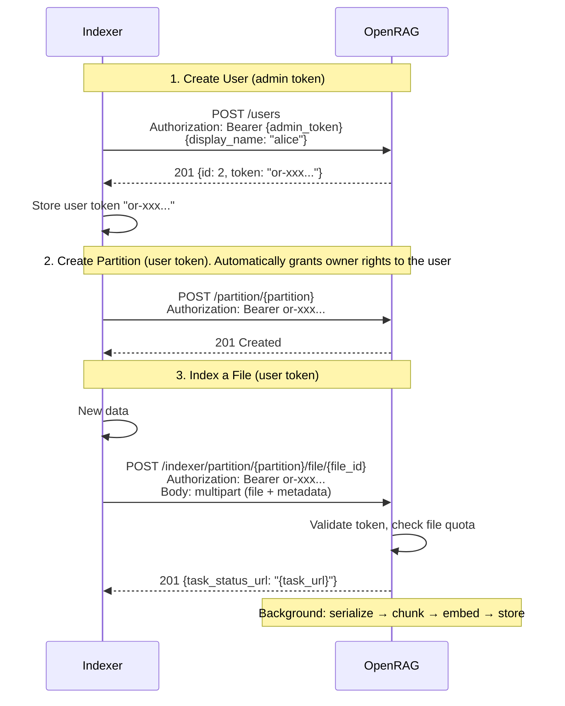
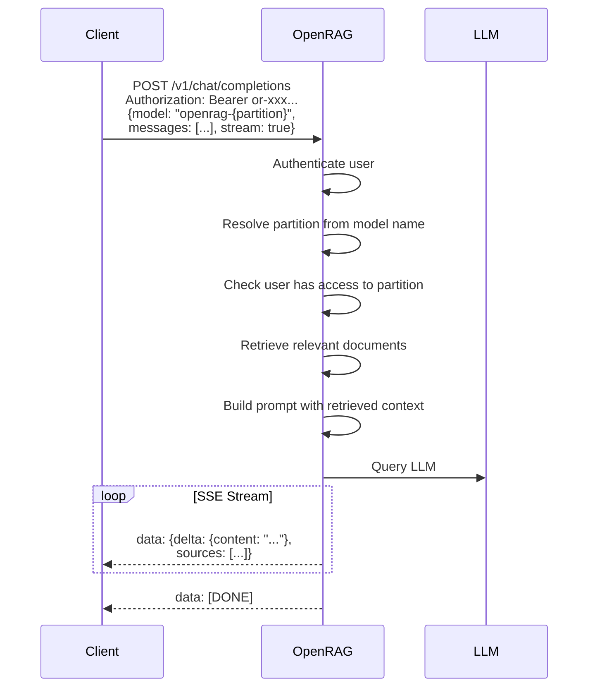

The FastAPI-powered backend provides a comprehensive document-based question answering system using Retrieval-Augmented Generation (RAG). The API supports semantic search, document indexing, and chat completions across multiple data partitions with full OpenAI compatibility.

## 🔐 Authentication

All endpoints require authentication when **enabled** (by adding a authorization token `AUTH_TOKEN` in your **`.env`**). Include your **`AUTH_TOKEN`** in the HTTP request header:

```http
Authorization: Bearer YOUR_AUTH_TOKEN
```

For OpenAI-compatible endpoints, `AUTH_TOKEN` serves as the `api_key` parameter. Use a placeholder like `'sk-1234'` when authentication is disabled (necessary for when using OpenAI client).

---

## 📡 API Serving Modes
This API can be served using **Uvicorn** (default) or **Ray Serve** for distributed deployments.

By default, the backend uses `uvicorn` to serve the FastAPI app.

To enable **Ray Serve**, set the following environment variable:

```bash
// .env
ENABLE_RAY_SERVE=true
```

Additional optional environment variables for configuring Ray Serve:

```bash
// .env
RAY_SERVE_NUM_REPLICAS=1             # Number of deployment replicas
RAY_SERVE_HOST=0.0.0.0               # Host address for Ray Serve HTTP proxy
RAY_SERVE_PORT=8080                  # Port for Ray Serve HTTP proxy
```

When using Ray Serve with a **remote cluster**, the HTTP server will be started on the **head node** of the cluster.


## 🚀 API Endpoints
### ℹ️ System Health
Verify server status and availability.
```http
GET /health_check
```

### ℹ️ openRAG version

Get openRAG version
```http
GET /version
```

---

### 📦 Document Indexing

#### Upload New File
```http
POST /indexer/partition/{partition}/file/{file_id}
```

Upload a new file to a specific partition for indexing.

**Parameters:**
- `partition` (path): Target partition name
- `file_id` (path): Unique identifier for the file

**Request Body (form-data):**
- `file` (binary): File to upload
- `metadata` (JSON string): File metadata (e.g., `{"owner": "user1"}`)

**Responses:**
- `201 Created`: Returns task status URL
- `409 Conflict`: File already exists in partition

##### Upload files while modeling relations between them

OpenRAG supports document relationships to enable context-aware retrieval.
You can model relationships between files using the `metadata` field during upload. Different relationship types can be represented using the `relationship_id` and `parent_id` metadata fields, depending on the use case: folder-based relationships, email threads, etc. (see [Document Relationships documentation](/openrag/documentation/linked_files/#examples) for more details).

* To represent native [simple folder-based relationships between files](/openrag/documentation/linked_files/#-folder-based-organization), rely exclusively on `relationship_id`:

```http
POST /indexer/partition/{partition}/file/{file_id}
Authorization: Bearer YOUR_AUTH_TOKEN
Content-Type: multipart/form-data

file: <binary data>
metadata: {
  "relationship_id": "documents/projects/2024/q1",
  ...
}
```

* for email threads, one can rely on both `relationship_id` (to group emails in the same thread) and `parent_id` (to model reply hierarchies within the thread). See the [Document Relationships documentation](/openrag/documentation/linked_files/#-email-threads) for more details and examples.

**Example: Original Email (Root)**
```http
POST /indexer/partition/emails/file/email_a_id
Authorization: Bearer YOUR_AUTH_TOKEN
Content-Type: multipart/form-data

file: <email binary data>
metadata: {
  "relationship_id": "thread-123",
  "parent_id": null,
  ...
}
```

**Example: Reply Email (Child)**
```http
POST /indexer/partition/emails/file/email_b_id
Authorization: Bearer YOUR_AUTH_TOKEN
Content-Type: multipart/form-data

file: <email binary data>
metadata: {
  "relationship_id": "thread-123",
  "parent_id": "email_a_id",
  ...
}
```
For context-aware search, see [search endpoints](#-semantic-search) and [relationship-based file fetching](#partitions--files-management). 

#### Replace Existing File
```http
PUT /indexer/partition/{partition}/file/{file_id}
```

Replace an existing file in the partition. Deletes the current entry and creates a new indexing task.

**Parameters:** Same as POST endpoint
**Request Body:** Same as POST endpoint
**Response:** `202 Accepted` with task status URL

#### Update File Metadata
```http
PATCH /indexer/partition/{partition}/file/{file_id}
```

Update file metadata without reindexing the document.

**Request Body (form-data):**
- `metadata` (JSON string): Updated metadata

**Response:** `200 OK` on successful update

#### Delete File
```http
DELETE /indexer/partition/{partition}/file/{file_id}
```

Remove a file from the specified partition.

**Responses:**
- `204 No Content`: Successfully deleted
- `404 Not Found`: File not found in partition

#### Check Indexing Status
```http
GET /indexer/task/{task_id}
```

Monitor the progress of an asynchronous indexing task.

**Response:** Task status information

---

#### See logs of a given task
```http
GET /indexer/task/{task_id}/logs
```

#### Get error details of a failed task 
```http
GET /indexer/task/{task_id}/error
```


### 🔍 Semantic Search

* Search Across Multiple Partitions
```http
GET /search/
```

Perform semantic search across specified partitions.

**Query Parameters:**
| Parameter           | Type    | Default | Description |
|---------------------|---------|---------|-------------|
| `partitions` (optional)        | array   | ["all"] | Partitions to search. (optional) |
| `text`              | string  | required | Search query |
| `top_k` (optional)             | integer | 5       | Number of initial results (optional) |
| `include_related` (optional)   | boolean | `false`   | Include chunks from files with same `relationship_id` |
| `include_ancestors` (optional) | boolean | `false`   | Include chunks from ancestor files (via `parent_id` chain) |
| `related_limit` (optional)     | integer | 20      | Max related/ancestor chunks to fetch per result (used when `include_related` or `include_ancestors` is true) |
| `filter` (optional)            | string  | None    | Milvus filter expression string for additional filtering. Supports comparison (`==`, `!=`, `>`, `<`, `>=`, `<=`), range (`IN`, `LIKE`), and logical (`AND`, `OR`, `NOT`) operators. |

**Responses:**
- `200 OK`: JSON list of document links (HATEOAS format)
- `400 Bad Request`: Invalid partitions parameter

* Search Within Single Partition
```http
GET /search/partition/{partition}
```

Search within a specific partition only.

**Query Parameters:**

| Parameter           | Type    | Default | Description |
|---------------------|---------|---------|-------------|
| `text`              | string  | required | Search query |
| `top_k` (optional)             | integer | 5       | Number of initial results (optional) |
| `include_related` (optional)   | boolean | `false`   | Include chunks from files with same `relationship_id` |
| `include_ancestors` (optional) | boolean | `false`   | Include chunks from ancestor files (via `parent_id` chain) |
| `related_limit` (optional)     | integer | 20      | Max related/ancestor chunks to fetch per result (used when `include_related` or `include_ancestors` is true) |
| `filter` (optional)            | string  | None    | Milvus filter expression string for additional filtering. Supports comparison (`==`, `!=`, `>`, `<`, `>=`, `<=`), range (`IN`, `LIKE`), and logical (`AND`, `OR`, `NOT`) operators. |

**Response:** Same as multi-partition search

* Search Within Specific File
```http
GET /search/partition/{partition}/file/{file_id}
```

Search within a particular file in a partition.

**Query Parameters:** Same as partition search, including `filter`.
**Response:** Same as other search endpoints

---

### 📄 Document Extraction

#### Get Extract Details
```http
GET /extract/{extract_id}
```

Retrieve specific document extract (chunk) by ID.

**Response:** JSON containing extract content and metadata

---

### Partitions & files Management

* Get Files by Relationship

```http
GET /{partition}/relationships/{relationship_id}
```

Returns all files sharing the same `relationship_id` within a partition.

**Parameters:**
- `partition` — partition name
- `relationship_id` — the relationship group identifier (client-defined)

**Response:**
```json
{
  "files": [
    {
      "file_id": "doc-a-id",
      "filename": "Document A",
      "relationship_id": "group-123",
      "parent_id": null
    },
    {
      "file_id": "doc-b-id",
      "filename": "Document B",
      "relationship_id": "group-123",
      "parent_id": "doc-a-id"
    }
  ]
}
```

* Get File Ancestors

```http
GET /{partition}/file/{file_id}/ancestors
```

Returns the complete ancestor path from root to the specified file.

:::note
Returns only the direct ancestor path, not sibling branches.
:::

**Parameters:**
- `partition` — partition name
- `file_id` — the file to trace ancestors for
- `max_ancestor_depth` (optional) — limit on ancestor depth to return. None means unlimited.

**Response:**
```json
{
  "ancestors": [
    {
      "file_id": "email-a-id",
      "filename": "Original Email",
      "parent_id": null
    },
    {
      "file_id": "email-b-id",
      "filename": "First Reply",
      "parent_id": "email-a-id"
    },
    {
      "file_id": "email-c-id",
      "filename": "Second Reply",
      "parent_id": "email-b-id"
    }
  ]
}
```

---

### 💬 OpenAI-Compatible Chat

These endpoints provide full OpenAI API compatibility for seamless integration with existing tools and workflows. For detailed example of openai usage [see this section](#example-openai-client-usage)

* List Available Models
```http
GET /v1/models
```

List all available RAG models (partitions).

**Model Naming Convention:**
- Pattern: `openrag-{partition_name}` => This model allows to chat specifically with the partition `{partition_name}`
- Special model: `partition-all` (queries entire vector database)

* Chat Completions
```http
POST /v1/chat/completions
```

OpenAI-compatible chat completion using **`RAG` pipeline**.

**Request Body:**
```bash frame="none" title="Testing the openai OpenRAG chat completions endpoint with curl"
curl -X POST http://localhost:8080/v1/chat/completions \
  -H "Content-Type: application/json" \
  -H "Authorization: Bearer YOUR_AUTH_TOKEN" \
  -d '{
    "model": "openrag-{partition_name}",
    "messages": [
      {
        "role": "user",
        "content": "Your question here"
      }
    ],
    "temperature": 0.1,
    "stream": false
  }'
```

You can also direclty use this endpoint with no RAG pipeline, i.e. to directly use the LLM.
For that, instead of using the `openrag` prefix for the model, you can:
- Specify no model
- Specify an empty model
- Specify the openRAG configured model, e.g. `Mistral-Small-3.1-24B-Instruct-2503`.

**Request Body:**
```bash frame="none" title="Testing the openai OpenRAG chat completions endpoint with curl"
curl -X POST http://localhost:8080/v1/chat/completions \
  -H "Content-Type: application/json" \
  -H "Authorization: Bearer YOUR_AUTH_TOKEN" \
  -d '{
    "model": "",
    "messages": [
      {
        "role": "user",
        "content": "Your question here"
      }
    ],
    "temperature": 0.1,
    "stream": false
  }'
```


* Text Completions
```http
POST /v1/completions
```
OpenAI-compatible text completion endpoint.

#### Extra arguments

* When using the openai endpoint /v1/chat/completions, you can pass extra arguments **via the `metadata` field** of the request body to customize the RAG behavior:

| Option | Type | Default | Description |
|--------|------|---------|-------------|
| `websearch` | `bool` | `false` | Augments the RAG context with live web search results. When used with a partition (`openrag-{partition}`), document and web results are combined. When used without a partition (direct LLM mode), web results are the sole context. Requires `WEBSEARCH_API_TOKEN` to be configured. See [web search configuration](/openrag/documentation/env_vars/#web-search-configuration). |
| `spoken_style_answer` | `bool` | `false` | Generates a succinct spoken-style conversational answer based on the retrieved documents. |
| `use_map_reduce` | `bool` | `false` | Uses a map-reduce strategy to aggregate information from multiple documents. See [map-reduce configuration](/openrag/documentation/env_vars/#map--reduce-configuration). |
| `llm_override` | `object` | `null` | Routes the request to a different LLM endpoint while still using OpenRAG's RAG pipeline (retrieval, reranking, prompt construction). Accepts: `base_url` (string), `api_key` (string), `model` (string). Any field not provided falls back to the default OpenRAG LLM configuration. |

Examples:

```bash title="Enabling conversational answer with openai chat completions endpoint"
curl -X 'POST' 'http://localhost:8080/v1/chat/completions' \
  -H 'accept: application/json' \
  -H 'Authorization: Bearer YOUR_AUTH_TOKEN' \
  -H 'Content-Type: application/json' \
  -d '{
  "model": "openrag-{partition_name}",
  "messages": [
    {
      "role": "user",
      "content": "your_query"
    }
  ],
  "temperature": 0.3,
  "stream": false,
  "metadata": {
    "spoken_style_answer": true
  }
}'
```

```bash title="Enabling web search with RAG documents"
curl -X 'POST' 'http://localhost:8080/v1/chat/completions' \
  -H 'accept: application/json' \
  -H 'Authorization: Bearer YOUR_AUTH_TOKEN' \
  -H 'Content-Type: application/json' \
  -d '{
  "model": "openrag-{partition_name}",
  "messages": [
    {
      "role": "user",
      "content": "your_query"
    }
  ],
  "stream": false,
  "metadata": {
    "websearch": true
  }
}'
```

```bash title="Web search only (no RAG partition)"
curl -X 'POST' 'http://localhost:8080/v1/chat/completions' \
  -H 'accept: application/json' \
  -H 'Authorization: Bearer YOUR_AUTH_TOKEN' \
  -H 'Content-Type: application/json' \
  -d '{
  "model": "",
  "messages": [
    {
      "role": "user",
      "content": "your_query"
    }
  ],
  "stream": false,
  "metadata": {
    "websearch": true
  }
}'
```

```bash title="Using a custom LLM endpoint with OpenRAG's RAG pipeline"
curl -X 'POST' 'http://localhost:8080/v1/chat/completions' \
  -H 'accept: application/json' \
  -H 'Authorization: Bearer YOUR_AUTH_TOKEN' \
  -H 'Content-Type: application/json' \
  -d '{
  "model": "openrag-{partition_name}",
  "messages": [
    {
      "role": "user",
      "content": "your_query"
    }
  ],
  "stream": false,
  "metadata": {
    "llm_override": {
      "base_url": "https://api.openai.com/v1",
      "api_key": "sk-your-openai-key",
      "model": "gpt-4o"
    }
  }
}'
```


### 🔧 Tools

Tools are useful features that can be called directly by the client.


* List available tools
```http
GET /v1/tools
```

**Request:**
```bash frame="none"
curl http://localhost:8080/v1/tools
```

**Response:**
```json
[
    {
        "name": "Tool name",
        "description": "Tool description"
    }
]
```

* Execute a tool
```http
POST /v1/tools/execute
```

The parameters are given in multipart.

**Request:**
```bash frame="none"
curl -X POST http://localhost:8080/v1/tools/execute \
  -H "Content-Type: multipart/form-data" \
  -H "Authorization: Bearer YOUR_AUTH_TOKEN" \
  -F "file=@file.pdf" \
  -F 'tool={"name":"extractText"}' \
  -F 'metadata={"mime":"application/pdf","name":"test.pdf"}' \
```

**Response:**
```json
{
  "message": "File content"
}
```

## 💡 Usage Examples

#### Bulk File Indexing

For indexing multiple files programmatically, you can use this script [`data_indexer.py`](http://github.com/linagora/openrag/blob/main/utility/data_indexer.py) utility script in the [`📁 utility`](https://github.com/linagora/openrag/tree/main/utility) folder or simply use **`indexer ui`**.

#### Example OpenAI Client Usage

```python {9-10}
from openai import OpenAI, AsyncOpenAI

api_base_url = "http://localhost:8080" # fastapi base url of 'openrag'
base_url = f"{api_base_url}/v1"

auth_key = ... # your api authentification key AUTH_TOKEN in your .env. Is authentification is disabled, use a placeholder like 'sk-1234'
client = OpenAI(api_key=auth_key, base_url=base_url)

your_partition= 'my_partition' # name of your partition
model = f"openrag-{your_partition}"
settings = {
    'model': model,
    'temperature': 0.3,
    'stream': False
}

response = client.chat.completions.create(
    **settings,
    messages=[
        {"role": "user", "content": "What information do you have about...?"}
    ]
)
```

---

## ⚠️ Error Handling

The API uses standard HTTP status codes:

- `200 OK`: Successful request
- `201 Created`: Resource created successfully
- `202 Accepted`: Request accepted for processing
- `204 No Content`: Successful deletion
- `400 Bad Request`: Invalid request parameters
- `404 Not Found`: Resource not found
- `409 Conflict`: Resource already exists

Error responses include detailed JSON messages to help with debugging and integration.


## Sequence diagrams

### External Indexing Flow

An external indexer uses an admin token to create a user, then uses the returned user token for all subsequent operations.



### Chat Completion Flow

Query indexed documents via the OpenAI-compatible chat completions endpoint.


