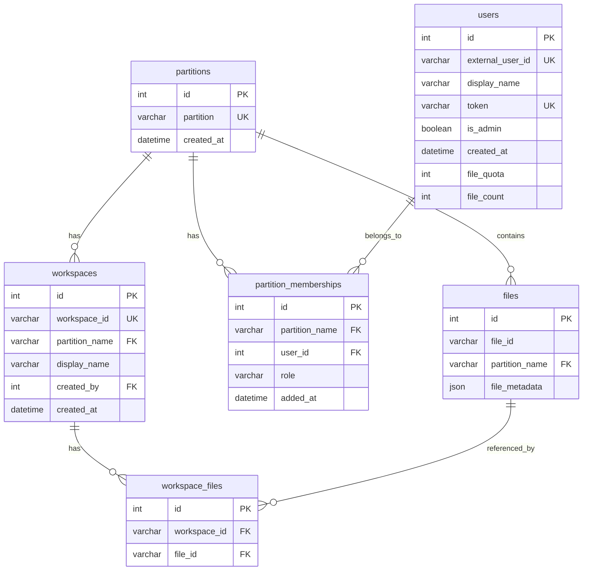
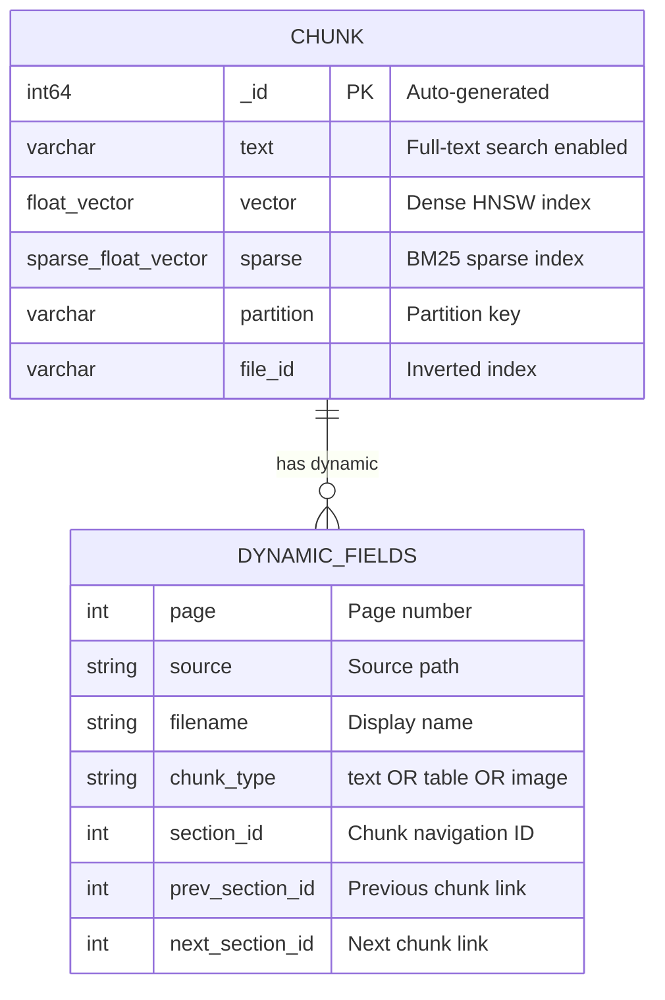
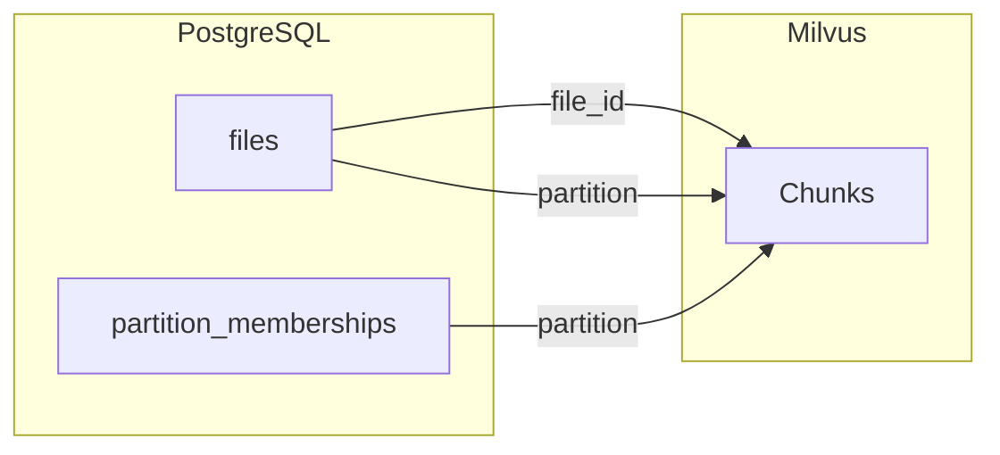
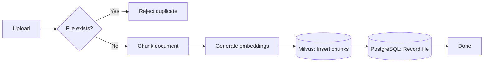
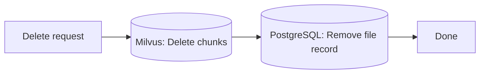
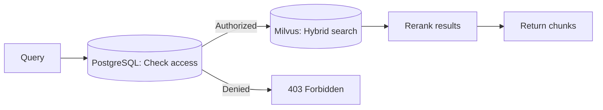

OpenRAG uses a dual-database architecture:
- **PostgreSQL** for metadata (users, partitions, files, access control)
- **Milvus** for content (document chunks, embeddings, vector search)

---

## PostgreSQL Schema

Implemented using **SQLAlchemy ORM** with PostgreSQL as the backend.

### `users`

Stores information about API users and administrators.

| Column         | Type      | Description |
|----------------|-----------|-------------|
| `id`           | Integer (PK) | Unique user identifier |
| `external_user_id` | String (nullable, unique) | Optional external system reference |
| `display_name` | String | Display name |
| `token`        | String (unique, hashed) | SHA-256 hash of the user's API token |
| `is_admin`     | Boolean | Marks system administrator users |
| `created_at`   | DateTime | Timestamp of creation |
| `file_quota`   | Integer (nullable) | Max files allowed for that user |
| `file_count`   | Integer (default=0) | Number of uploaded files |

**Relationships:** `memberships` one-to-many → `PartitionMembership`

---

### `partitions`

Represents a logical workspace or "space" that groups files and users.

:::caution
"partition" must be unique across all users as it is used as a partition key in Milvus.
:::

| Column       | Type | Description |
|---------------|------|-------------|
| `id`          | Integer (PK) | Unique partition identifier |
| `partition`   | String (unique, indexed) | Human-readable name / key |
| `created_at`  | DateTime | Timestamp of creation |

**Relationships:**
- `files` one-to-many → `File`
- `memberships` one-to-many → `PartitionMembership`

---

### `files`

Represents an indexed file belonging to a partition.

| Column          | Type | Description |
|------------------|------|-------------|
| `id`             | Integer (PK) | Internal file identifier |
| `file_id`        | String (indexed) | External file identifier (e.g., hash or ID) |
| `partition_name` | String (FK → `partitions.partition`) | Partition that owns the file |
| `file_metadata`  | JSON | Additional metadata (format, size, etc.) |
| `relationship_id` | String (nullable, indexed) | Groups related documents (e.g., email thread ID, folder path) |
| `parent_id`       | String (nullable, indexed) | Points to hierarchical parent (e.g., parent email) |

**Indexes:**
- `ix_relationship_partition (relationship_id, partition_name)` — enables efficient relationship queries
- `ix_parent_partition (parent_id, partition_name)` — enables efficient ancestor traversal

**Constraints:**
- `UniqueConstraint(file_id, partition_name)` → a file can appear only once per partition
- Composite index `ix_partition_file (partition_name, file_id)` for efficient queries

---

### `partition_memberships`

Defines the many-to-many relationship between users and partitions with role-based access control.

| Column          | Type | Description |
|------------------|------|-------------|
| `id`             | Integer (PK) | Unique row ID |
| `partition_name` | String (FK → `partitions.partition`, CASCADE) | Partition identifier |
| `user_id`        | Integer (FK → `users.id`, CASCADE) | Linked user |
| `role`           | String | Role: `owner`, `editor`, or `viewer` |
| `added_at`       | DateTime | Timestamp of membership creation |

**Constraints:**
- `UniqueConstraint(partition_name, user_id)` → a user can appear only once per partition
- `CheckConstraint(role IN ('owner','editor','viewer'))` → role validation
- Composite index `ix_user_partition (user_id, partition_name)`

---

### `workspaces`

Groups files within a partition into named subsets for scoped search and chat. See [Workspaces](/openrag/documentation/workspaces/) for full details.

| Column          | Type | Description |
|------------------|------|-------------|
| `id`             | Integer (PK) | Internal identifier |
| `workspace_id`   | String (unique) | Client-facing workspace identifier |
| `partition_name` | String (FK → `partitions.partition`, CASCADE) | Owning partition |
| `display_name`   | String (nullable) | Human-readable name |
| `created_by`     | Integer (FK → `users.id`, SET NULL) | User who created the workspace |
| `created_at`     | DateTime | Timestamp of creation |

**Relationships:** `files` many-to-many → `File` (via `workspace_files`)

---

### `workspace_files`

Join table linking workspaces to files.

| Column          | Type | Description |
|------------------|------|-------------|
| `id`             | Integer (PK) | Internal identifier |
| `workspace_id`   | String (FK → `workspaces.workspace_id`, CASCADE) | Workspace reference |
| `file_id`        | String (FK → `files.file_id`, CASCADE) | File reference |

**Constraints:**
- `UniqueConstraint(workspace_id, file_id)` → a file appears at most once per workspace

---

## Milvus Schema

Milvus stores document chunks with their vector embeddings. The collection uses dynamic fields for flexible metadata.

**Indexes:**
- **HNSW** on `vector` field - Fast approximate nearest neighbor search with cosine similarity
- **BM25** on `text` field - Keyword-based sparse retrieval
- **Inverted** on `file_id` - Fast filtering by file
- **Partition key** on `partition` - Automatic data isolation by tenant

---

## Database Integration

The two databases are linked by shared identifiers: `file_id` and `partition` exist in both systems.

| Data | PostgreSQL | Milvus | Rationale |
|------|:----------:|:------:|-----------|
| Partition metadata | ✓ | - | Referential integrity, access control |
| File inventory | ✓ | - | Single source of truth for uploaded files |
| Workspace membership | ✓ | - | File grouping resolved at query time |
| User accounts & roles | ✓ | - | Authentication, ACID compliance |
| Document chunks | - | ✓ | Optimized for vector operations |
| Dense embeddings | - | ✓ | HNSW similarity search |
| Sparse embeddings | - | ✓ | BM25 keyword matching |

---

## Operation Flows

### Add File

### Delete File

### Search

---

## Access Control

- Roles (`owner`, `editor`, `viewer`) determine what users can do in each partition
- `is_admin` users are privileged globally (admin endpoints, user management)
- `SUPER_ADMIN_MODE=true` allows the global admin to bypass all partition-level restrictions

---

## File Quotas

Limits the number of files a user can upload (indexed files + pending tasks).

- Admins always have unlimited quota and can update quota for a given user
- `DEFAULT_FILE_QUOTA < 0` to disable quota checking (e.g., default `-1`)
- `DEFAULT_FILE_QUOTA >= 0` to set a default quota for all users (note: `0` means users may upload zero files — quota is still enforced)

The default value `DEFAULT_FILE_QUOTA` is -1, meaning that file quota checking is bypassed.

---

## Token Handling

- Tokens are generated at user creation time (`or-<random hex>`)
- Only a **SHA-256 hash** is stored in the database
- During authentication, the incoming Bearer token is hashed and compared with the stored hash
