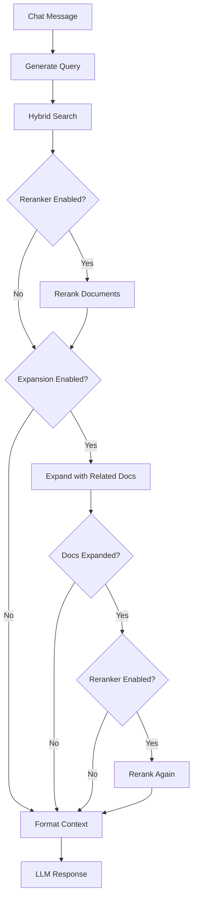

This document explains how document relationships are modeled in OpenRAG, providing a flexible system for connecting related documents and preserving structural hierarchies.

## **1. Overview**

OpenRAG provides a general-purpose relationship system that allows clients to model connections between documents. This system is agnostic to specific use cases and can represent various relationship types including email threads, chat conversations, folder structures and more.

The relationship system supports two core patterns:

- **Relationship-based grouping**: Groups related documents together using a shared identifier
- **Hierarchical parent-child links**: Tracks parent-child relationships within groups

### Relationship Fields

Two fields enable flexible relationship modeling:

* **`relationship_id`**: A shared identifier for documents that belong together
  - Can represent any logical grouping (thread ID, folder path, project identifier, etc.)
  - Documents sharing the same `relationship_id` are considered related
  - Optional and client-defined based on use case

* **`parent_id`**: Tracks hierarchical relationships by pointing to the direct parent document's ID
  - References the parent document's `file_id`
  - Enables recursive traversal from any document back to the root
  - Can be used in combination with `relationship_id`
  - Optional and client-defined based on use case

**Key Principle:** The system does not enforce any specific relationship semantics. Clients are responsible for defining what relationships mean and how to use these fields to model their domain-specific structures.


## **2. Data Model**

### File Model Extensions
See the [SQL File model extended](/openrag/documentation/data_model/#-files) with `relationship_id` and `parent_id`.

### Examples
The relationship system is flexible enough to model various real-world scenarios. Here are some common examples:

#### 📧 Email Threads

**Use Case:**  
Email conversations form hierarchical reply chains where each message references the one it's replying to. Preserving this structure enables context-aware retrieval of entire conversations.

**Modeling:**
- `relationship_id` = email thread ID (from mail server)
- `parent_id` = ID of the email being replied to

**Example:**
```txt
Email A (original)
├── relationship_id: "thread-abc123"
├── parent_id: null 
└── file_id: "email-a"
    └── Email B (reply)
        ├── relationship_id: "thread-abc123"
        ├── parent_id: "email-a"
        └── file_id: "email-b"
            └── Email C (reply to B)
                ├── relationship_id: "thread-abc123"
                ├── parent_id: "email-b"
                └── file_id: "email-c"
```

**Benefits:**
- Retrieve entire conversation thread as a unit
- Navigate from any reply back to the original message
- Context-aware search expands single email results to full threads

#### 📁 Folder-Based Organization

**Use Case:**  
Files stored in the same folder are conceptually related and should be retrievable as a group to enrich the context for RAG.

**Modeling Option 1 - Flat Grouping:**
- `relationship_id` = normalized folder path (e.g., `documents/projects/2024`)
- `parent_id` = **not used** (files are peers in the same folder)

**Example:**
```txt
Documents/2024/Q1/
├── Report.pdf
│   ├── relationship_id: "documents/2024/q1"
│   └── parent_id: null
├── Budget.xlsx
│   ├── relationship_id: "documents/2024/q1"
│   └── parent_id: null
└── Notes.md
    ├── relationship_id: "documents/2024/q1"
    └── parent_id: null
```

**Modeling Option 2 - Nested Folder Hierarchy:**
- `relationship_id` = root folder identifier (shared across all nested files)
- `parent_id` = immediate parent folder's identifier

**Example:**
```txt
FolderA/
├── fileA
│   ├── relationship_id: "folderA"
│   └── parent_id: "folderA"
├── fileB
│   ├── relationship_id: "folderA"
│   └── parent_id: "folderA"
├── folderA.1/
│   └── fileA.1
│       ├── relationship_id: "folderA"
│       └── parent_id: "folderA.1"
└── folderA.2/
    └── fileA.2
        ├── relationship_id: "folderA"
        └── parent_id: "folderA.2"
```

- All files share `relationship_id: "folderA"` (grouped under the root folder)
- Each file's `parent_id` points to its immediate parent folder.

:::caution
**Folder Hierarchy Considerations**

The data model supports folder hierarchies via `parent_id`, but implementing this requires careful design decisions:

**Open Questions:**
- Should retrieving a file automatically fetch files from parent folders?
- Should it include files from child folders?

The implementation of nested folder hierarchy behavior should be decided based on specific retrieval requirements before enabling this pattern.
:::

## **3. API Endpoints**

* Indexation endpoints: refer to this [documents indexing section](/openrag/documentation/api/#upload-files-while-modeling-relations-between-them)
* For search with related documents, refer to [this section](/openrag/documentation/api/#-semantic-search)
* One can fetch documents that share a relationship or fetch the ancestors of a given file: refer to the [Partition and File section](/openrag/documentation/api/#partitions--files-management)

## **4. Usage with the RAG Pipeline**

Document relationships integrate seamlessly into the RAG pipeline workflow:

<div style="overflow-x: auto;">



</div>

:::caution
**Context Size Limitation**

At the `Format Context` stage, only documents fitting within the fixed context size limit (`RERANKER_TOP_K` × `CHUNK_SIZE`, which defaults to 5120 tokens) are retained. Additional filtering strategies should be considered to remove irrelevant chunks.

**Possible Approaches:**
* **Map-Reduce**: Processes chunks in batches, summarizes relevant ones individually, filters out irrelevant ones, then combines the summaries. However, this approach requires a high-token endpoint and can be time-consuming and resource-intensive when dealing with large numbers of chunks.

**Future Considerations:**
* **Relevance Filtering**: Apply additional filtering after expansion to retain only the most relevant chunks—potentially leveraging reranking scores as a filtering criterion.
:::