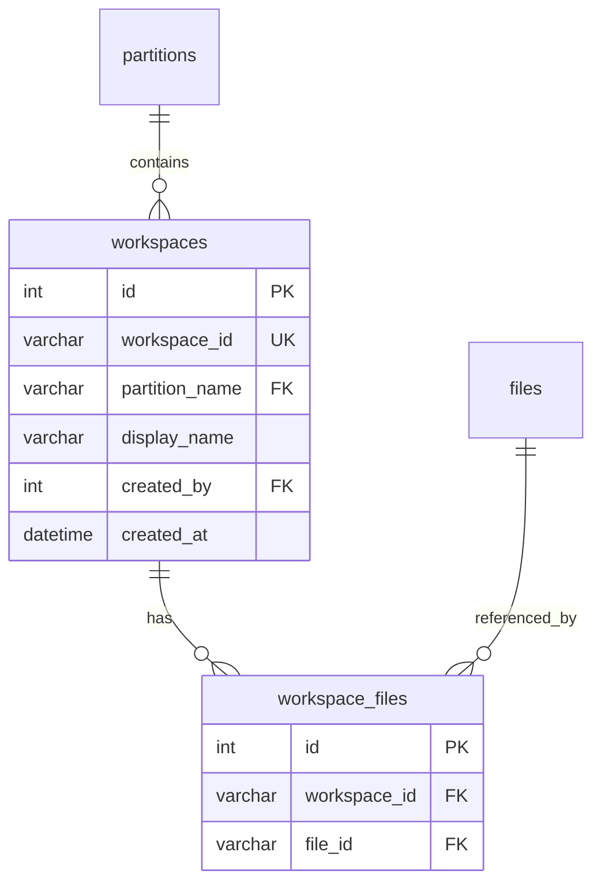
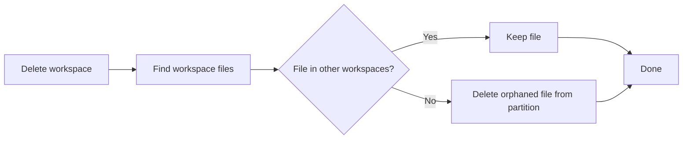

Workspaces let you organize files within a partition into named subsets. When searching or chatting, you can target a specific workspace so that only its files are considered — without affecting the underlying partition structure.

---

## Concepts

- A **workspace** belongs to exactly one partition
- A file can belong to **multiple workspaces** (or none)
- Workspaces do not duplicate files — they reference existing partition files
- Deleting a workspace deletes **orphaned files** (files not in any other workspace) from the partition automatically
- Deleting a file removes it from all workspaces it belongs to

---

## Data Model



**Constraints:**
- `UniqueConstraint(workspace_id)` — workspace IDs are globally unique
- `UniqueConstraint(workspace_id, file_id)` on `workspace_files` — a file appears at most once per workspace
- Cascade delete: dropping a workspace removes its `workspace_files` rows

---

## API Endpoints

All workspace endpoints live under `/partition/{partition}/workspaces`.

### Workspace CRUD

| Method | Endpoint | Auth | Description |
|--------|----------|------|-------------|
| POST | `/partition/{partition}/workspaces` | Editor | Create a workspace |
| GET | `/partition/{partition}/workspaces` | Viewer | List all workspaces in partition |
| GET | `/partition/{partition}/workspaces/{workspace_id}` | Viewer | Get workspace details |
| DELETE | `/partition/{partition}/workspaces/{workspace_id}` | Owner | Delete workspace and orphaned files |

### Workspace File Management

| Method | Endpoint | Auth | Description |
|--------|----------|------|-------------|
| POST | `/partition/{partition}/workspaces/{workspace_id}/files` | Editor | Add files to workspace |
| GET | `/partition/{partition}/workspaces/{workspace_id}/files` | Viewer | List files in workspace |
| DELETE | `/partition/{partition}/workspaces/{workspace_id}/files/{file_id}` | Editor | Remove file from workspace |

---

### Create a Workspace

```bash
curl -X POST "$BASE_URL/partition/my-partition/workspaces" \
  -H "Authorization: Bearer $TOKEN" \
  -H "Content-Type: application/json" \
  -d '{"workspace_id": "project-alpha", "display_name": "Project Alpha"}'
```

```json
{"status": "created", "workspace_id": "project-alpha"}
```

### List Workspaces

```bash
curl "$BASE_URL/partition/my-partition/workspaces" \
  -H "Authorization: Bearer $TOKEN"
```

```json
{
  "workspaces": [
    {
      "workspace_id": "project-alpha",
      "partition_name": "my-partition",
      "display_name": "Project Alpha",
      "created_by": 1,
      "created_at": "2026-03-06T10:00:00"
    }
  ]
}
```

### Add Files to a Workspace

```bash
curl -X POST "$BASE_URL/partition/my-partition/workspaces/project-alpha/files" \
  -H "Authorization: Bearer $TOKEN" \
  -H "Content-Type: application/json" \
  -d '{"file_ids": ["report.pdf", "notes.md"]}'
```

```json
{"status": "added", "file_ids": ["report.pdf", "notes.md"]}
```

### Delete a Workspace

```bash
curl -X DELETE "$BASE_URL/partition/my-partition/workspaces/project-alpha" \
  -H "Authorization: Bearer $TOKEN"
```

```json
{"status": "deleted", "orphaned_files_deleted": 1}
```

Files that belonged **only** to the deleted workspace are automatically removed from the partition. Files shared with other workspaces are preserved.

---

## Upload with Workspace Assignment

Files can be added to one or more workspaces at upload time using the `workspace_ids` form parameter:

```bash
curl -X POST "$BASE_URL/indexer/partition/my-partition/file/my-file-id" \
  -H "Authorization: Bearer $TOKEN" \
  -F "file=@document.pdf" \
  -F 'metadata={"mimetype": "application/pdf"}' \
  -F 'workspace_ids=["project-alpha", "project-beta"]'
```

The `workspace_ids` field accepts a JSON array of workspace IDs. Each workspace must exist in the target partition, otherwise the request is rejected with a 404.

---

## Workspace-Scoped Search

Pass the `workspace` query parameter to restrict search results to files in that workspace:

```bash
curl "$BASE_URL/search/partition/my-partition?text=quarterly+results&workspace=project-alpha" \
  -H "Authorization: Bearer $TOKEN"
```

Only chunks from files belonging to the `project-alpha` workspace are returned.

### Multi-Partition Search

The `workspace` parameter also works with multi-partition search:

```bash
curl "$BASE_URL/search?partitions=my-partition&text=quarterly+results&workspace=project-alpha" \
  -H "Authorization: Bearer $TOKEN"
```

---

## Workspace-Scoped Chat

To scope a chat completion to a workspace, include the `workspace` field in the request metadata:

```bash
curl -X POST "$BASE_URL/v1/chat/completions" \
  -H "Authorization: Bearer $TOKEN" \
  -H "Content-Type: application/json" \
  -d '{
    "model": "openrag-my-partition",
    "messages": [{"role": "user", "content": "Summarize the Q1 results"}],
    "metadata": {"workspace": "project-alpha"}
  }'
```

The RAG pipeline resolves the workspace to its file list and filters the vector search accordingly.

---

## Deletion Behavior

### Deleting a Workspace



### Deleting a File

When a file is deleted from a partition (via `DELETE /partition/{partition}/file/{file_id}`), it is automatically removed from all workspaces that reference it.

### Deleting a Partition

When a partition is deleted, all its workspaces and workspace-file associations are cascade-deleted along with the files.
