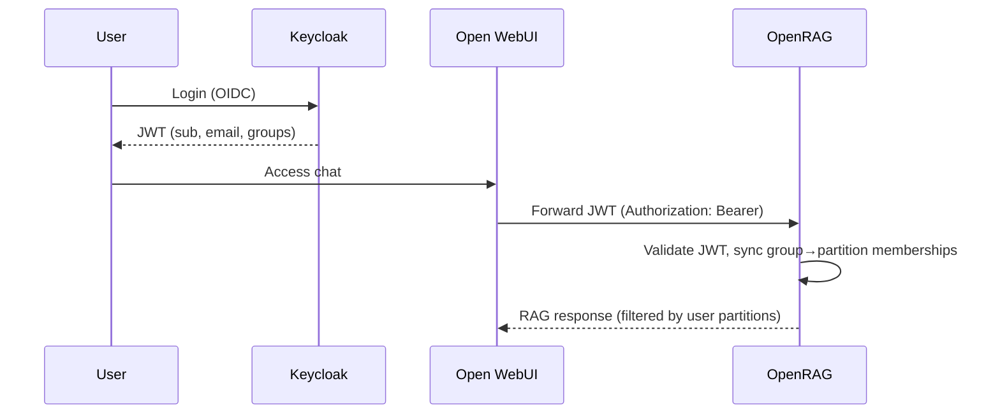

This guide explains how to configure **Keycloak** as a shared identity provider for both **Open WebUI** (chat frontend) and **OpenRAG** (RAG backend), so that user identity and group-based partition access flow seamlessly from login to document retrieval.

## Architecture Overview



## 1. Keycloak Configuration

### Create a Client for OpenRAG

1. In your Keycloak realm, go to **Clients** > **Create client**
2. Set **Client ID** to `openrag` (this will be `OIDC_AUDIENCE`)
3. Set **Client authentication** to **On**
4. Set **Valid redirect URIs** to your Open WebUI URL (e.g., `https://chat.example.com/*`)
5. Note the **Client secret** from the Credentials tab

### Configure Group Claim Mapper

1. Go to **Client scopes** > **openrag-dedicated** > **Mappers** > **Create mapper**
2. Choose **Group Membership** mapper type
3. Set:
   - **Name**: `groups`
   - **Token Claim Name**: `groups`
   - **Full group path**: ON
   - **Add to ID token**: ON
   - **Add to access token**: ON

### Create Groups

Create groups following this naming convention:

| Group path | OpenRAG role | Description |
|-----------|-------------|-------------|
| `/rag-query/<partition>` | viewer | Can search and view documents |
| `/rag-edit/<partition>` | editor | Can upload and manage files |
| `/rag-admin/<partition>` | owner | Full partition control |

Example groups:
- `/rag-query/finance` — Read access to the "finance" partition
- `/rag-edit/finance` — Upload files to "finance"
- `/rag-admin/hr` — Full control of the "hr" partition

Assign users to the appropriate groups.

## 2. Open WebUI Configuration

Set these environment variables in your Open WebUI deployment:

```bash
# Enable OAuth/OIDC
ENABLE_OAUTH_SIGNUP=true
OAUTH_CLIENT_ID=openrag
OAUTH_CLIENT_SECRET=<your-client-secret>
OPENID_PROVIDER_URL=https://keycloak.example.com/realms/myrealm/.well-known/openid-configuration

# Forward the user's JWT to backend APIs
ENABLE_FORWARD_OAUTH_TOKEN=true

# OpenRAG as OpenAI-compatible backend
OPENAI_API_BASE_URL=https://openrag.example.com/v1
OPENAI_API_KEY=unused  # JWT is forwarded instead
```

With `ENABLE_FORWARD_OAUTH_TOKEN=true`, Open WebUI sends the user's Keycloak JWT as the `Authorization: Bearer` header to OpenRAG, instead of a static API key.

## 3. OpenRAG Configuration

Set these environment variables:

```bash
# Switch to OIDC mode
AUTH_MODE=oidc

# Keycloak OIDC settings
OIDC_ISSUER_URL=https://keycloak.example.com/realms/myrealm
OIDC_AUDIENCE=openrag
OIDC_JWKS_CACHE_TTL=3600
OIDC_GROUP_CLAIM=groups
OIDC_AUTO_PROVISION=true

# Group prefix mapping (defaults shown)
OIDC_GROUP_PREFIX_VIEWER=rag-query/
OIDC_GROUP_PREFIX_EDITOR=rag-edit/
OIDC_GROUP_PREFIX_OWNER=rag-admin/

# Sync mode: "additive" (default) or "authoritative"
OIDC_GROUP_SYNC_MODE=additive
```

### Sync Modes

- **Additive** (default): Adds missing partition memberships from Keycloak groups. Never removes existing memberships. Upgrades roles when the JWT grants a higher role, but never downgrades.

- **Authoritative**: Fully syncs OIDC-sourced memberships. Memberships created via Keycloak are added/updated/removed to match the JWT groups exactly. Manually-created memberships (via the API) are never touched.

## 4. How It Works

1. User logs into Open WebUI via Keycloak SSO
2. User sends a chat message in Open WebUI
3. Open WebUI forwards the request to OpenRAG's `/v1/chat/completions` with the user's JWT
4. OpenRAG's AuthMiddleware:
   - Validates the JWT signature against Keycloak's JWKS
   - Extracts `sub`, `email`, `groups` claims
   - Auto-provisions the user if first login
   - Syncs Keycloak groups to partition memberships
5. OpenRAG resolves accessible partitions and executes the RAG pipeline
6. Response is filtered to only include sources from authorized partitions

## 5. Verifying the Setup

### Check JWT Contents

Decode a Keycloak token to verify the groups claim:

```bash
# Get a token
TOKEN=$(curl -s -X POST \
  "https://keycloak.example.com/realms/myrealm/protocol/openid-connect/token" \
  -d "grant_type=password&client_id=openrag&client_secret=SECRET&username=user&password=pass" \
  | jq -r '.access_token')

# Decode payload
echo $TOKEN | cut -d'.' -f2 | base64 -d 2>/dev/null | jq '.groups'
```

Expected output:
```json
["/rag-query/finance", "/rag-edit/legal"]
```

### Test OpenRAG Directly

```bash
curl -H "Authorization: Bearer $TOKEN" https://openrag.example.com/v1/models
```

Should return only the models (partitions) the user has access to.

## Troubleshooting

| Problem | Solution |
|---------|----------|
| 403 "Missing token" | Verify `ENABLE_FORWARD_OAUTH_TOKEN=true` in Open WebUI |
| 401 "Token has expired" | Check clock sync between servers and token lifetimes in Keycloak |
| User has no partitions | Verify the `groups` claim is present in the JWT and matches the prefix convention |
| 503 "Failed to fetch JWKS" | Check that OpenRAG can reach the Keycloak server at `OIDC_ISSUER_URL` |
